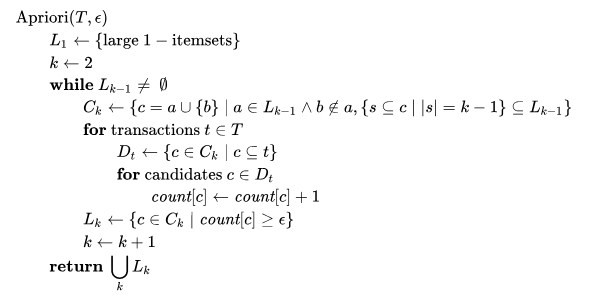

<h1><b>What is Apriori Algorithm?</b></h1>

Apriori[1] is an algorithm for frequent item set mining and association rule learning over transactional databases. It proceeds by identifying the frequent individual items in the database and extending them to larger and larger item sets as long as those item sets appear sufficiently often in the database. The frequent item sets determined by Apriori can be used to determine association rules which highlight general trends in the database: this has applications in domains such as market basket analysis.

<h2>Overview</h2>
The Apriori algorithm was proposed by Agrawal and Srikant in 1994. Apriori is designed to operate on databases containing transactions (for example, collections of items bought by customers, or details of a website frequentation or IP addresses). Other algorithms are designed for finding association rules in data having no transactions (Winepi and Minepi), or having no timestamps (DNA sequencing). Each transaction is seen as a set of items (an itemset). Given a threshold C1, the Apriori algorithm identifies the item sets which are subsets of at least C transactions in the database.

Apriori uses a "bottom up" approach, where frequent subsets are extended one item at a time (a step known as candidate generation), and groups of candidates are tested against the data. The algorithm terminates when no further successful extensions are found.

Apriori uses breadth-first search and a Hash tree structure to count candidate item sets efficiently. It generates candidate item sets of length k from item sets of length k-1. Then it prunes the candidates which have an infrequent sub pattern. According to the downward closure lemma, the candidate set contains all frequent k-length item sets. After that, it scans the transaction database to determine frequent item sets among the candidates.

The pseudo code for the algorithm is given below for a transaction database T, and a support threshold of epsilion. Usual set theoretic notation is employed, though note that {\displaystyle T} T is a multiset. C_{k} is the candidate set for level {\displaystyle k} k. At each step, the algorithm is assumed to generate the candidate sets from the large item sets of the preceding level, heeding the downward closure lemma. count[c] accesses a field of the data structure that represents candidate set c, which is initially assumed to be zero. Many details are omitted below, usually the most important part of the implementation is the data structure used for storing the candidate sets, and counting their frequencies.

